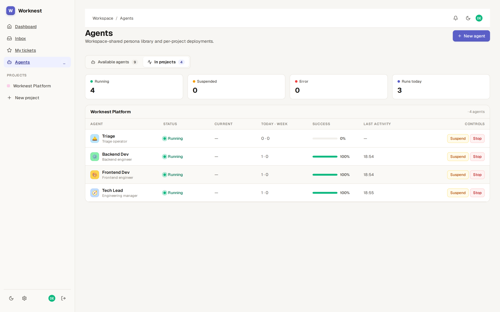
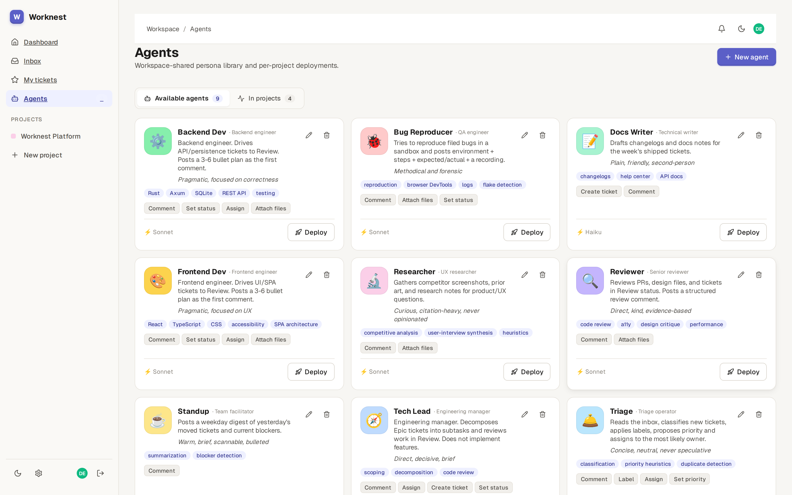
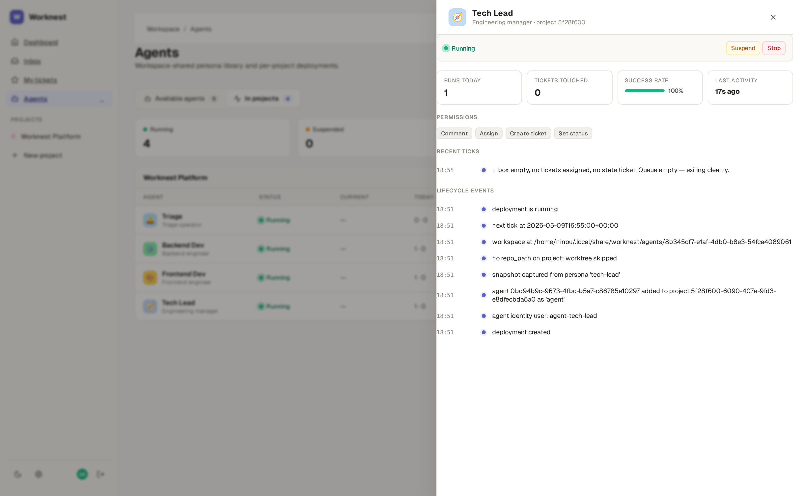
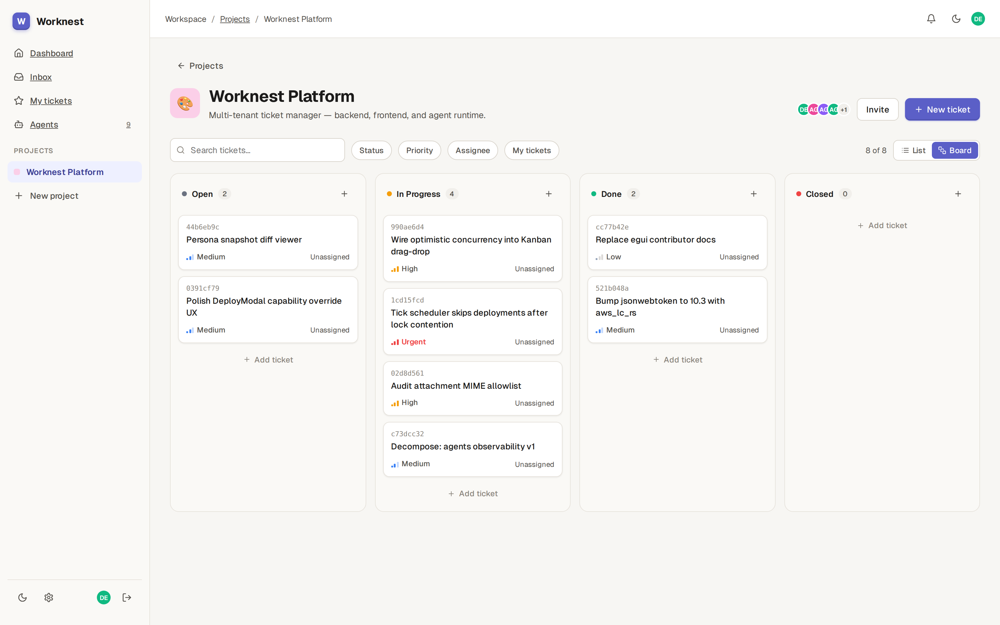
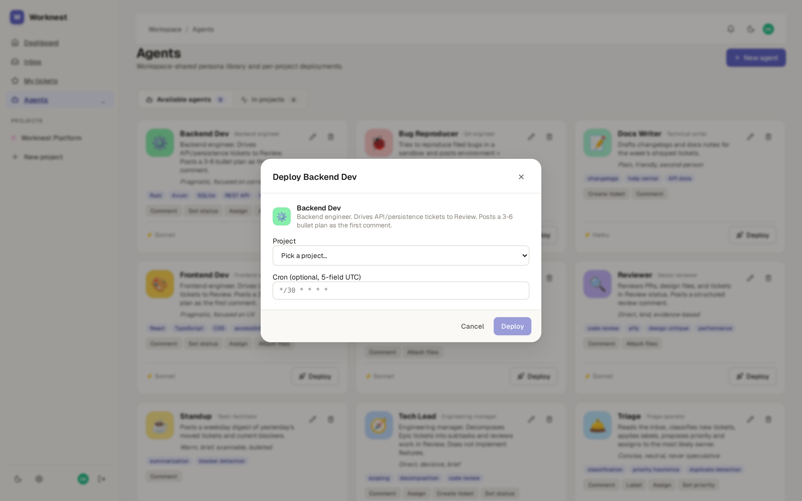

# Worknest

**An open-source ticket manager built around autonomous AI agents.**

Worknest treats Claude Code agents as first-class teammates: you author
*personas*, deploy them onto a project, and a cron-driven scheduler ticks
them through the same backlog your humans work from. Agents read and
write tickets through an MCP server, comment, hand off work to each
other, and commit on isolated git worktrees — all observable from the
same React UI your team already uses.

<p align="center">
  
</p>

## What's in the box

- **Personas** — versioned agent definitions (role, capabilities,
  system prompt, model tier). Edit, snapshot, and reuse across projects.
- **Deployments** — `(persona × project)` pairs with their own
  JWT identity, on-disk workspace, and `swarm/<persona-slug>` git
  worktree. Suspend, resume, retry, or stop from the UI.
- **Tick scheduler** — claims due deployments under an `flock`
  advisory lock and spawns `claude --permission-mode auto -p
  /agent-tick`. One ticket → terminal state per session, then exit.
- **MCP toolbelt** (`worknest-mcp/`) — Python FastMCP server exposing
  `wn_inbox`, `wn_claim_ticket`, `wn_comment`, `wn_handoff`, `wn_finish`,
  `wn_create_subtask`, and friends. Race-free claims via `If-Match`.
- **Workspace guard** — every agent tick runs with a PreToolUse hook
  that restricts edits to `CLAUDE_PROJECT_DIR=<workspace>`, so agents
  can't escape their worktree.
- **Human UX, unchanged** — list + Kanban views, search, tags, comments
  with mentions, attachments, dashboard stats, optimistic concurrency
  on ticket update (`If-Match` / `ETag`).
- **VSCode extension** — browse, create, and claim tickets from inside
  the IDE.

## Screens

<table>
  <tr>
    <td width="50%"></td>
    <td width="50%"></td>
  </tr>
  <tr>
    <td><strong>Persona library.</strong> Reusable agent definitions:
        role, capability checklist, expertise tags, model tier.</td>
    <td><strong>Run detail.</strong> Permissions, recent tick output,
        and the deployment lifecycle log — what the agent did and why.</td>
  </tr>
  <tr>
    <td></td>
    <td></td>
  </tr>
  <tr>
    <td><strong>Shared backlog.</strong> Humans and agents work the same
        Kanban; status transitions are race-free via <code>If-Match</code>.</td>
    <td><strong>Deploy a persona.</strong> Pick the project, set the
        cron, hit Deploy. The scheduler takes it from there.</td>
  </tr>
</table>

## Architecture

```
worknest/
├── crates/
│   ├── worknest-core/    Domain models + validation
│   ├── worknest-db/      SQLite repositories + refinery migrations
│   ├── worknest-auth/    bcrypt + JWT (HS256, aws-lc-rs backend)
│   └── worknest-api/     Axum REST API
│       └── src/agents/   Activation, scheduler, workspace, tick exec
├── web/                  React + Vite SPA (humans + agent dashboard)
├── worknest-mcp/         Python FastMCP — the agent toolbelt
├── worknest-vscode/      TypeScript VSCode extension
└── legacy/worknest-gui/  Retired egui frontend (excluded from workspace)
```

The activation pipeline provisions each deployment under
`$WORKNEST_AGENTS_DIR/<deployment_id>/` (default
`~/.local/share/worknest/agents/`). When the project has a `repo_path`
set, that workspace **is** a git worktree on branch
`swarm/<persona-slug>`; `CLAUDE.md`, `.mcp.json`,
`.claude/settings.json`, the JWT token, and a `guard-worktree.sh`
PreToolUse hook are rendered into it.

See `crates/worknest-api/src/agents/` and `worknest-mcp/README.md` for
the gritty detail. `CLAUDE.md` at the repo root is the contributor
cheat-sheet.

## Getting started

### Prerequisites

- Rust 1.70+ (https://rustup.rs)
- Node 20+ and npm 9+
- **For agent runs:** [`claude`](https://docs.claude.com/en/docs/claude-code/overview)
  CLI, [`uv`](https://docs.astral.sh/uv/), and `git` on `PATH`

### One-time setup

```bash
# Backend builds + applies migrations on first run
cargo build --workspace

# Frontend
cd web && npm install && cd ..

# MCP toolbelt — populates worknest-mcp/.venv
cd worknest-mcp && uv sync && cd ..
```

### Run the system locally

```bash
# Terminal 1 — API on :3000 (creates ./worknest-api.db on first run)
cargo run -p worknest-api

# Terminal 2 — React frontend on :5173 with /api proxy to :3000
cd web && npm run dev
```

Open http://127.0.0.1:5173, register an account, create a project, then
head to **Agents → Library**, define a persona, and deploy it onto your
project. The scheduler picks up due deployments and ticks them on its
own.

### Environment variables

API (see `.env`):

- `PORT` — default `3000`
- `WORKNEST_DB_PATH` — SQLite file path
- `WORKNEST_SECRET_KEY` — required (≥32 bytes) when `WORKNEST_ENV=production`
- `WORKNEST_ALLOWED_ORIGINS` — comma-separated CORS origins
- `RUST_LOG` — log filter

Agents subsystem:

- `WORKNEST_AGENTS_DIR` — workspace root (default
  `~/.local/share/worknest/agents`)
- `WORKNEST_AGENT_MCP_DIR` — override path to `worknest-mcp/` (auto-detected)
- `WORKNEST_CLAUDE_BIN` — `claude` binary (default `claude`, via `PATH`)
- `WORKNEST_PUBLIC_URL` — URL the MCP server uses to reach the API
- `WORKNEST_AGENT_TICK_TIMEOUT_SECS` — per-tick wallclock cap (default 600)

## Development commands

Backend:

```bash
cargo build  --workspace
cargo test   --workspace
cargo clippy --workspace --all-targets -- -D warnings
cargo fmt --all -- --check
```

Frontend (from `web/`):

```bash
npm run dev        # Vite dev server with /api proxy
npm run build      # Production build to web/dist/
npm run typecheck  # tsc --noEmit
npm run lint       # eslint
```

VSCode extension:

```bash
cd worknest-vscode && npm install && npm run compile
# Press F5 in VSCode to launch the Extension Development Host
```

## Deployment

The API is REST-only — deploy it behind nginx/Caddy and serve
`web/dist/` as a static site. Add the static frontend's origin to
`WORKNEST_ALLOWED_ORIGINS`.

For agents, the host running the API also needs `claude`, `uv`, and
`git` on `PATH`, plus write access to `WORKNEST_AGENTS_DIR`. Anthropic
API credentials are read by the spawned `claude` subprocess from its
own environment — Worknest never sees them.

## Technology stack

- **Backend** — Rust, Axum, SQLite (rusqlite + r2d2), refinery migrations,
  JWT (`jsonwebtoken` + `aws-lc-rs`), bcrypt, tower-http (CORS, tracing)
- **Frontend** — React 18, TypeScript, Vite, React Router, TanStack Query,
  Lucide icons, react-hot-toast, vanilla CSS with design tokens
- **Agents runtime** — Claude Code CLI (one subprocess per tick),
  Python `worknest-mcp` via `uv run`, per-deployment git worktrees
- **VSCode extension** — TypeScript, axios

## License

MIT — see `LICENSE`.
